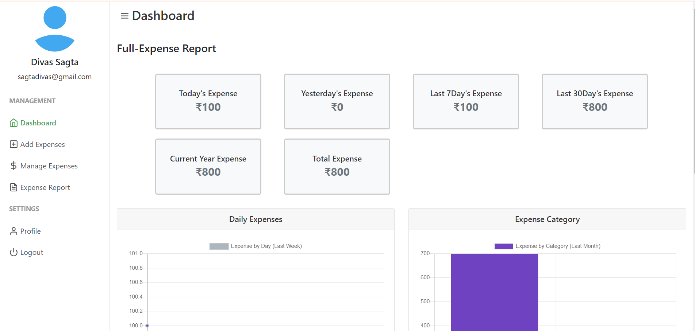

# Project Name: Personal Expense Tracker

- Personal Expense Tracker is a user-friendly Full Stack web-application made using JavaScript, PHP and MYSQL that allows unlimited number of users to Register, Log In, and efficiently Manage their personal expenses across diverse categories.

- Users have the flexibility to add, view, and delete expenses, providing a seamless experience for tracking their financial activities. 

- The system also empowers users to manage expenses by sorting them based on months and categories, facilitating a clear overview of their spending habits.

- Moreover, the DBMS generates detailed expense reports on a daily, monthly, and yearly basis, assisting users in making informed financial decisions. 

- This project simplifies Expense tracking and enhances financial management for users of all backgrounds.  

© Made By: Divas Sagta, Roll No: 25, Section: A